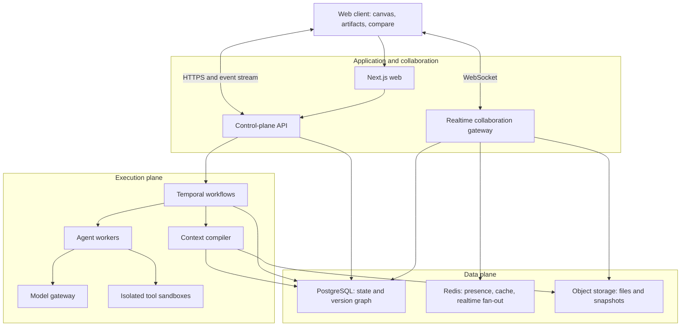

# Branchwork

> A branchable multiplayer workspace where humans and AI agents build together on shared context.

`Branchwork` is a working name.

## The idea

Chat was designed for one person, one model, and one disposable conversation. Real AI work increasingly involves several people, agents, models, files, decisions, and long-running executions.

Branchwork is an AI-native shared workspace. Humans place artifacts on a canvas, select the exact context an agent should receive, run several agents in parallel, and fork, compare, and merge their results.

It is not another chatbot, coding agent, or generic workflow builder. It is the collaboration and version-control layer around AI work.

## Product loop

1. A human creates or imports artifacts onto a shared canvas.
2. They select the artifacts relevant to a task.
3. They press `/` and assign work to an agent.
4. Branchwork freezes an immutable context receipt for that execution.
5. The agent works on a new branch and streams visible progress.
6. A person can fork the result with a different model, instruction, or tool set.
7. The team compares alternatives and merges the chosen result.
8. Context, evidence, cost, execution history, and decisions remain inspectable.

## The three defining primitives

### Spatial context

The canvas is not decoration. Selection, grouping, links, and explicit boundaries determine what an agent can see. Spatial proximity may suggest context, but it never silently grants access.

Every run creates a **context receipt** containing the exact artifact versions, instructions, model, tools, permissions, and budgets supplied to the agent.

### Agent branches

Every agent run begins from an immutable snapshot and writes proposals to its own branch. A user can fork any result, change the model or instructions, and explore another path without destroying previous work.

### Shared agent desktop

Humans see which agents are queued, working, waiting, blocked, completed, or failed; which artifacts they own; their dependencies and handoffs; their spending; and what requires approval.

Agents never silently mutate the canonical workspace. Their work is proposed, inspected, and merged.

## Example

A founder places a customer interview, competitor page, product notes, and a rough brief on the canvas. They select the first three artifacts and summon a research agent.

The agent creates a positioning memo on branch A. The founder forks it:

- branch B asks a faster, cheaper model for a concise version;
- branch C asks a frontier model to challenge the assumptions;
- a reviewer agent checks factual claims against the original evidence.

The founder compares the branches, accepts the structure from B and several insights from C, resolves one conflict, and merges the final memo. Every claim retains its provenance.

## Wedge and long-term vision

**Wedge:** the best workspace for branching and coordinating multiple agents over shared, visible context.

**Initial users:** AI-native founders, researchers, product teams, and technical teams already moving context manually between several AI tools.

**Long-term vision:** Branchwork becomes the neutral execution and collaboration substrate for AI work. Any human or agent can create work, fork an approach, delegate a branch, request approval, and merge an outcome across models, tools, and artifact types.

The end state is not a nicer canvas. It is the versioned workspace and execution runtime for organizations whose workforce includes many AI agents.

## Why this can become a company

The durable value is not a prompt or access to one model. It is the accumulated work graph:

- artifact and branch history;
- explicit context and permission boundaries;
- human edits, approvals, and merge decisions;
- reusable execution patterns;
- model performance by task type;
- organizational memory grounded in provenance;
- interoperability across model and tool providers.

As models converge, Branchwork can route each task using measured quality, cost, latency, policy, and historical performance. Routing is a capability inside the runtime—not the whole product.

## First release

The first release proves one complete interaction:

> Place text, URLs, and files on a canvas → select context → summon an agent → receive an artifact on a branch → fork it → compare two results → merge one into the main workspace.

The first supported output is structured rich text with evidence links. This can demonstrate research, planning, analysis, and design without requiring fake merge semantics for every possible artifact.

Do not build yet:

- a general-purpose group chat;
- dozens of agent personalities;
- unrestricted agent-to-agent conversation;
- every enterprise connector;
- a marketplace;
- a universal agent framework;
- fake semantic merging for images and binary files.

## Product rules

- **Artifacts over messages.** Chat may assist work, but durable artifacts are the state.
- **Explicit context over hidden retrieval.** Users can inspect what an agent received.
- **Branches over overwrites.** Agent results remain proposals until merged.
- **Bounded autonomy.** Workflows define permissions, budgets, checkpoints, and stop conditions; agents choose tactics inside them.
- **Use the smallest valid workflow.** A simple task does not traverse unnecessary planning, review, or multi-agent steps.
- **Provider independence.** Models and worker frameworks are replaceable backends.
- **Production foundations, narrow surface.** Build real recovery and security without premature infrastructure sprawl.

## Core system model

Branchwork uses three separate consistency mechanisms:

1. **CRDT collaboration** handles concurrent live edits and reconnects within an active branch.
2. **An immutable version graph** handles snapshots, forks, comparisons, merges, and provenance.
3. **An append-only event history** handles audit, execution state, and observability.

CRDT state is not branch history, and the audit log is not the canvas database.

### Core entities

- Tenant, user, membership, and workspace
- Canvas document and presence session
- Artifact and immutable artifact version
- Snapshot and branch
- Context receipt
- Agent identity
- Execution and execution step
- Tool grant
- Merge and merge conflict
- Audit event
- Evaluation

All tenant-owned records carry a tenant ID and authorization metadata from the beginning.

## Architecture



### Production stack as of July 2026

| Layer             | Choice                                                                                             |
| ----------------- | -------------------------------------------------------------------------------------------------- |
| Runtime           | Node.js 24 LTS and Python 3.13 workers                                                             |
| Web               | Next.js 16.2, React 19.2, strict TypeScript                                                        |
| Canvas            | tldraw SDK 5 with custom shapes                                                                    |
| Rich text         | Tiptap with Yjs                                                                                    |
| Collaboration     | Hocuspocus/Yjs over WebSockets                                                                     |
| API               | TypeScript with Fastify                                                                            |
| Durable workflows | Temporal                                                                                           |
| Agent internals   | Direct provider SDK initially; LangGraph only for agents requiring a real internal reasoning graph |
| AI interface      | OpenAI Responses API and Agents SDK behind a provider-neutral gateway                              |
| Database          | PostgreSQL 18 with pgvector                                                                        |
| Ephemeral state   | Redis                                                                                              |
| Files             | S3-compatible object storage                                                                       |
| Contracts         | JSON Schema or Protobuf with generated TypeScript and Python types                                 |
| Observability     | OpenTelemetry, Prometheus, Grafana, Tempo, Loki, and Sentry                                        |
| Infrastructure    | Containers, Terraform, and managed services first                                                  |

Review tldraw's current commercial license before production distribution. Pin exact dependency versions in the lockfile; do not use floating versions.

### Temporal and LangGraph

Temporal owns the durable product workflow: retries, crashes, timers, cancellation, approvals, handoffs, and parallel execution.

LangGraph is optional inside an agent activity when that worker genuinely needs conditional planning, repeated tool use, reflection, or a complex reasoning graph.

```text
Temporal workflow
├── freeze context
├── run agent activity
│   └── LangGraph only when the agent requires it
├── evaluate output
├── wait for human approval if required
└── commit proposed artifact version
```

Do not let Temporal and LangGraph both own the same state machine.

## Branch and merge semantics

An execution begins from snapshot `S0`, freezes context receipt `C`, and creates branch `B`. The agent reads only the versions authorized by `C` and proposes new versions on `B`.

When merging:

1. identify the common ancestor;
2. run a type-specific three-way comparison;
3. apply non-conflicting changes;
4. present conflicts with provenance;
5. create a new immutable version and merge record;
6. atomically advance main using optimistic concurrency.

Rich text merges structured blocks. Canvas layout merges objects and properties. Tables eventually merge schemas and cells. Binary artifacts require an explicit choice until a real type-specific adapter exists.

## Context and permissions

The context compiler:

- validates access to every selected source;
- preserves source and version IDs;
- retrieves only inside the granted scope;
- prioritizes explicitly selected context;
- enforces token, cost, time, and data-boundary budgets;
- records truncation and retrieval decisions;
- produces the user-visible context receipt.

Canonical product state stays in Branchwork's database and object store. A model provider's conversation state is never the only copy.

## Security baseline

- OIDC authentication with tenant-scoped roles and resource authorization.
- Permission checks on HTTP, WebSocket, retrieval, and tool boundaries.
- Short-lived, least-privilege tool grants.
- Secrets stored in a managed vault, not application tables.
- Isolated containers or microVMs for untrusted tool and code execution.
- Egress allowlists and CPU, memory, filesystem, time, and cost limits.
- Encryption in transit and at rest.
- Prompt-injection defenses enforced at permission and tool boundaries.
- Audit records for data access, approvals, and external side effects.
- Configurable retention and deletion policies.

## Build strategy

Start with a **modular monolith plus isolated workers**:

- one web application;
- one control-plane API;
- one realtime collaboration service;
- one durable workflow worker group;
- PostgreSQL, Redis, and object storage;
- strict module and event contracts that can later become services.

This provides distributed execution where it matters without starting with a fragile microservice maze.

## Build roadmap

### Phase 0 — foundations, days 1–3

- Create a pnpm monorepo with web, API, realtime, agent worker, and shared packages.
- Pin runtimes and configure strict type checking, formatting, linting, and tests.
- Start PostgreSQL, Redis, S3-compatible storage, and Temporal locally.
- Define tenant-aware schemas for artifacts, versions, snapshots, branches, contexts, executions, events, and merges.
- Add migrations, secret validation, structured logging, tracing, and health checks.
- Add CI for types, tests, migrations, dependency review, and containers.
- Prove a stub workflow can wait and resume after a worker restart.

### Phase 1 — collaborative canvas, week 1

- Add tldraw with text, URL, file, agent, and output cards.
- Add Yjs/Hocuspocus collaboration, presence, persistence, and reconnect.
- Make selection plus `/` create a context receipt.
- Ensure two sessions converge and acknowledged edits survive restarts.

### Phase 2 — branches, week 2

- Create immutable artifact versions and content hashes.
- Create branches from consistent snapshots.
- Implement fork, structured comparison, and rich-text three-way merge.
- Add optimistic concurrency, idempotency keys, and audit events.
- Prove simultaneous work cannot silently overwrite another branch.

### Phase 3 — durable agents, weeks 3–4

- Add Temporal workflows for execution, approval, retry, cancellation, and handoff.
- Add the model gateway and one real agent worker.
- Compile selected artifacts into bounded model context.
- Stream agent actions, evidence, status, cost, and errors to the UI.
- Write outputs only to execution branches.
- Enforce time, token, dollar, and tool budgets.

### Phase 4 — complete product loop, weeks 5–6

- Support text, URL, and file evidence.
- Generate a structured rich-text deliverable with citations.
- Fork with another model, instruction, or budget.
- Compare content, evidence, cost, and latency.
- Merge selected sections and resolve conflicts.
- Display agent ownership, dependencies, handoffs, and approvals.

### Phase 5 — private alpha, weeks 7–8

- Add tenant quotas, rate limits, model allowlists, and retention controls.
- Run load, reconnection, duplicate-event, worker-death, and partial-provider-failure tests.
- Add backups and perform a restore drill.
- Complete the threat model and security review.
- Onboard real users only after tenant isolation and recovery tests pass.

### Months 3–6

- Add connectors based on observed demand.
- Add tables and diagrams with honest type-aware merge policies.
- Add reusable workflows, approval graphs, and agent teams.
- Learn routing policies from evaluations and merge decisions.
- Publish an SDK for workers, tools, evaluators, and artifact types.
- Split services only when profiling demonstrates a real scaling or isolation need.

## What to build today

1. Create the monorepo and local infrastructure.
2. Define the core schemas and contracts.
3. Add a tldraw canvas with one custom artifact card.
4. Make selection plus `/` create a stub execution branch from an immutable context receipt.
5. Render a temporary worker result through the real event and persistence path.
6. Add the first end-to-end test:

```text
create artifact → select context → execute → produce branch → merge
```

The temporary worker can be replaced. The execution, version, event, and merge contracts must remain real.

## Run locally

Requirements:

- Node.js 24 LTS (the repository pins `24.14.0` for development)
- pnpm 11.7.0 through Corepack
- Docker Desktop for PostgreSQL, Redis, and object storage

```bash
corepack enable
pnpm install --frozen-lockfile
pnpm dev
```

The web application runs at [http://localhost:3000](http://localhost:3000) and the API health endpoint runs at [http://127.0.0.1:4000/health](http://127.0.0.1:4000/health).

Start local data services only when working on persistence:

```bash
docker compose up -d
docker compose ps
```

Run the complete verification suite before committing:

```bash
pnpm format:check
pnpm lint
pnpm typecheck
pnpm test
pnpm build
```

## Evaluation

Create 20 realistic tasks using public source packs with multiple documents, webpages, notes, and contradictory evidence. Compare:

1. one strong model in normal chat;
2. several chat tabs with manual context copying;
3. Branchwork with explicit context, branches, comparison, and merge.

Measure:

- time to an accepted artifact;
- number of manual context-copy actions;
- unsupported factual claims;
- evidence coverage;
- useful diversity between branches;
- cost and latency;
- percentage of generated content retained after merge;
- whether users can explain where an output came from.

Reliability tests must kill workers mid-step, reconnect clients, redeliver events, create concurrent branches, revoke permissions, exceed budgets, simulate missing files, and restore from backups.

### Private-alpha success gate

- five users complete the complete loop on their own work;
- at least 60% choose to fork or compare rather than accept the first result;
- users reach an accepted artifact faster than the multi-chat baseline;
- zero cross-tenant access failures;
- zero lost acknowledged edits;
- every execution failure is visible, attributable, and recoverable.

## Production quality bar

A feature is complete only when it has:

- a versioned contract and authorization rules;
- defined persistence and recovery behavior;
- idempotency and failure semantics;
- proportional unit, integration, and end-to-end tests;
- tracing, metrics, structured logs, and operator-visible errors;
- migration and rollback considerations;
- documented security and cost boundaries.

Initial design targets—not current claims:

- p95 collaborative update propagation below 250 ms in-region;
- normal reconnect and convergence below 3 seconds;
- no lost acknowledged edits;
- workflow event availability of 99.9%;
- deterministic replay of orchestration decisions;
- documented and tested recovery objectives.

## How to use this README while building

This file is the single source of truth for product direction, behavior, architecture, and sequence.

At the start of each coding session:

1. Read this README.
2. Select the next unfinished roadmap item.
3. Preserve the product rules, branch semantics, and architecture boundaries above.
4. Write or update the acceptance test.
5. Implement only that coherent slice.
6. Update this README in the same change if a decision changes.
7. Mark work complete only when its stated quality gates pass.

Use this instruction with a coding agent:

> Read `README.md`, identify the next unfinished task, and implement only that task. Preserve its product and architecture invariants, run the relevant quality gates, and update the README in the same change if the implementation changes an agreed decision.

## Current primary references

- [Node.js release schedule](https://nodejs.org/en/about/previous-releases)
- [React versions](https://react.dev/versions)
- [Next.js 16.2](https://nextjs.org/blog/next-16-2)
- [PostgreSQL documentation](https://www.postgresql.org/docs/)
- [tldraw SDK 5](https://tldraw.dev/blog/tldraw-sdk-5-0)
- [tldraw multiplayer starter](https://tldraw.dev/starter-kits/multiplayer)
- [Yjs documentation](https://docs.yjs.dev/)
- [Hocuspocus collaboration](https://tiptap.dev/docs/hocuspocus/guides/collaborative-editing)
- [Hocuspocus scalability](https://tiptap.dev/docs/hocuspocus/guides/scalability)
- [Temporal durable execution](https://docs.temporal.io/temporal)
- [Temporal workflows](https://docs.temporal.io/workflows)
- [OpenAI Agents SDK](https://developers.openai.com/api/docs/guides/agents)
- [OpenAI background mode](https://developers.openai.com/api/docs/guides/background)

## One-line pitch

> Chat gives you one answer. Branchwork lets humans and teams of agents explore, compare, and merge many paths on shared context.
